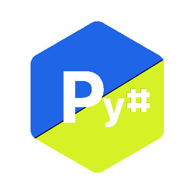

# PySharp Documentation

### PySharp is the Python language crossed with the syntax of C# (And various other syntax changes. I just liked the name PySharp. Don't judge me).

(Assuming you have already [installed python](https://phoenixnap.com/kb/how-to-install-python-3-windows))

<br>

### 1. Download the code
Click on the green 'Code' dropdown above and choose 'Download ZIP'.\
Unzip the ZIP file.\
You should find this README file, a PySharp logo, an example fizzbuzz program, an essentials.py file, and an interpreter.py file.

### 2. Run the example, or create your own program
To create your own program, make a new file with the extension '.pys'. When writing, follow the syntax as stated <a href='#syntax'>below</a>.\
To run a file (e.g. the fizzbuzz example), simply open up a terminal, navigate to the directory of the interpreter, and run:\
WINDOWS: ```py interpreter.py fizzbuzz.pys```\
MAC/LINUX: ```sudo python3 interpreter.py fizzbuzz.pys``` //NB: You may need to enter your account password for mac and linux.

### 3. Essentials
In your PySharp file, you may call PYS.{modulename}.{function} where modulename is the name of any module in the essentials.py file - e.g. PYS.Time.sleep(3) to delay the program 3 seconds.\
The essentials.py file is only imported if and when you call PYS, so as to not slow down your program unnecessarily.

<div id="syntax"></div>

### 4. The sytax
As stated above, PySharp is the Python language with parts of C# Syntax. Also, I just liked the name so some syntax may not be C# nor Python.

<br>

Syntax is identical to Python syntax with the following changes:

---

Comments may be written as ```//``` rather than ```#``` (Not required).

```py
print('the following comment is valid') // VALID
print('the following comment is also valid') # VALID
print('the following comment is not valid') / NOT VALID
```

---

Multi-line sections of comment can now be written as block comment with /* and */, rather than multiple single line comments (Not required).
```py
print('this line is not commented')

// These lines
// are single-line
// commented

/* These lines
are block
commented */

// ALL VALID
```

---

Conditional statements and loops (if, elif, else, while and for) may have brackets around the condition, and may have braces (Not required). A following conditional (elif, else) may be on the same line as, or a seperate line to, the previous closing brace ( } ).
```py
if (1 > 0) {
    print('1 is greater than 0')
}
elif 0 > 1 {
    print('0 is greater than 1')
} elif (0 = 1):
    print('0 is equal to 1')
elif 1 = 0:
    print('1 is equal to 0')
else {
    print('uuhhhh... surely one of those was correct')
}
else:
    print("two elses in a row? that's not even a thing! that's just for demonstration! idefkatp")

// ALL VALID
```
---

```None, True, False``` may all be written as ```null, true, false``` respectively (Not required).
```py
running = true

while (running == true) {
    if (running == null) {
        print("something's wrong, i can feel it")
    } elif (running == false) {
        print("hmm. something's even worse.")
    }
}

// ALL VALID
```

---

Indentation must be written in spaces, not tab characters (Required). However, you may choose how many spaces make up one indentation, as long as you tell the interpreter as the third argument when running the script (after specifying the Py# file name). If not specified, it will default to 4 spaces.
```py
while (true) {
  print('Highlight the indent to the left of this line to see that it is 2 spaces.') // VALID AS LONG AS SPECIFIED
    print('Highlight the indent to the left of this line to see that it is 4 spaces.') // VALID BY DEFAULT
	print('Highlight the indent to the left of this line to see that it is a tab character') // NOT VALID
}
```

---

Defining a function can be written as ```func``` rather than ```def``` (Not required).
```py
func helloWorld() {
    print('hello world! this function is valid')
}
def helloWorld() {
    print('hello world! this function is also valid')
}

// ALL VALID
```

---

PLEASE ALWAYS REMEMBER THAT Py# IS IN THE MAKING AND NOT FULLY FLESHED OUT. MANY BUGS ARE LIKELY. PLEASE REPORT ANY BUGS IN A PULL REQUEST.
